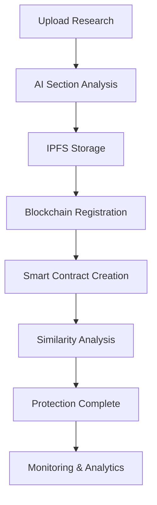

# AcademicIP - Blockchain Research Protection Platform

[](https://opensource.org/licenses/MIT)
[](https://storyprotocol.xyz)
[](https://ipfs.io)
[](https://reactjs.org)
[](https://typescriptlang.org)

> **Revolutionizing Academic Integrity Through Blockchain Technology**

AcademicIP is the world's first blockchain-powered platform specifically designed to protect academic research intellectual property. Using Story Protocol's advanced IP infrastructure, we provide researchers with instant, immutable proof of ownership for their work.

## 🌟 **Key Features**

### 🔐 **Instant IP Protection**
- **Real-time tokenization** of research sections (Abstract, Introduction, Methodology, etc.)
- **Immutable timestamps** proving creation date and authorship
- **Cryptographic proof** of ownership stored on blockchain
- **Legal-grade documentation** for court proceedings

### **AI-Powered Similarity Detection**
- **Advanced plagiarism detection** using machine learning
- **Real-time comparison** against global research database
- **Section-by-section analysis** for detailed insights
- **Similarity scoring** with actionable recommendations

### **Decentralized Storage**
- **IPFS integration** for permanent, censorship-resistant storage
- **Distributed backup** across global network
- **Cryptographic verification** of document integrity
- **Version control** for research iterations

### **Smart Licensing & Collaboration**
- **Automated licensing** through smart contracts
- **Revenue sharing** for collaborative research
- **Permission management** for institutional access
- **Royalty distribution** for commercial use

### **Comprehensive Analytics**
- **Research portfolio** management dashboard
- **Similarity trends** and risk assessment
- **Collaboration insights** and opportunities
- **Impact tracking** and citation analysis

###  **My Solution Impact**
- **Instant protection** - Ownership proven in seconds, not months
- **Global registry** - Searchable database of protected research
- **Legal certainty** - Blockchain evidence accepted worldwide
- **Innovation acceleration** - Researchers can share ideas safely

## 🏗️ **Technical Architecture**

### **Blockchain Layer**
```
Story Protocol Testnet (Chain ID: 1513)
├── IP Asset Registry: 0x292639452A975630802C17c9267169D5B2A5b1E3
├── Licensing Module: 0x260B6CB6284c89dbE660c0004233f7bB99B5edE7
├── Royalty Module: 0x1081250219B16cc3903Aa2d2d1403A75c6A8e5c2
└── Dispute Module: 0x696D4b5b4b7B2C3e7b5e5b5b5b5b5b5b5b5b5b5b
```

###  **Storage Layer**
```
IPFS (InterPlanetary File System)
├── Research Documents (Encrypted)
├── Metadata JSON (Public)
├── Section Hashes (Verification)
└── License Terms (Smart Contracts)
```

### **Database Layer**
```
Supabase PostgreSQL
├── User Management & Authentication
├── Research Paper Metadata
├── Similarity Analysis Results
└── Collaboration Records
```

### **Frontend Stack**
```
React 18 + TypeScript
├── Tailwind CSS (Styling)
├── Lucide React (Icons)
├── React Hook Form (Forms)
├── Recharts (Analytics)
└── Wagmi + RainbowKit (Web3)
```

## **Quick Start**

### 📋 **Prerequisites**
- Node.js 18+ and npm
- MetaMask wallet extension
- Git for version control

### ⚡ **Installation**

1. **Clone the repository**
   ```bash
   git clone https://github.com/yourusername/academic-ip-protection.git
   cd academic-ip-protection
   ```

2. **Install dependencies**
   ```bash
   npm install
   ```

3. **Environment setup**
   ```bash
   cp .env.example .env
   # Edit .env with your configuration (see Configuration section)
   ```

4. **Start development server**
   ```bash
   npm run dev
   ```

5. **Open in browser**
   ```
   http://localhost:5173
   ```

##  **Configuration**

### **Environment Variables**

Create a `.env` file in the root directory:

```env
# Supabase Configuration
VITE_SUPABASE_URL=https://your-project.supabase.co
VITE_SUPABASE_ANON_KEY=your-supabase-anon-key

# Story Protocol Configuration
VITE_STORY_PROTOCOL_RPC_URL=https://testnet.storyrpc.io
VITE_STORY_PROTOCOL_CHAIN_ID=1513
VITE_STORY_PROTOCOL_API_KEY=your-story-protocol-api-key

# IPFS Configuration (Infura)
VITE_IPFS_PROJECT_ID=your-infura-ipfs-project-id
VITE_IPFS_PROJECT_SECRET=your-infura-ipfs-project-secret
VITE_IPFS_GATEWAY_URL=https://ipfs.infura.io:5001

# WalletConnect Configuration
VITE_WALLETCONNECT_PROJECT_ID=your-walletconnect-project-id

# Application Configuration
VITE_APP_NAME=AcademicIP
VITE_APP_URL=https://your-app-url.netlify.app
```

### 🔧 **Service Setup**

#### **1. MetaMask Wallet**
- Install MetaMask browser extension
- Add Story Protocol Testnet:
  - Network Name: `Story Protocol Testnet`
  - RPC URL: `https://testnet.storyrpc.io`
  - Chain ID: `1513`
  - Currency Symbol: `IP`
  - Block Explorer: `https://testnet.storyprotocol.xyz`

#### **2. Supabase Database**
- Create account at [supabase.com](https://supabase.com)
- Create new project
- Run the SQL schema from `SETUP_GUIDE.md`
- Enable Row Level Security
- Get URL and anon key from project settings

#### **3. IPFS Storage (Infura)**
- Create account at [infura.io](https://infura.io)
- Create new IPFS project
- Get Project ID and Secret from project settings
- Test connection with provided utilities

#### **4. WalletConnect**
- Create account at [walletconnect.com](https://walletconnect.com)
- Create new project
- Get Project ID from dashboard

## 📖 **Usage Guide**

### 👤 **For Researchers**

1. **Account Setup**
   - Sign up with institutional email
   - Connect MetaMask wallet
   - Verify identity (optional)

2. **Upload Research**
   - Drag & drop research document
   - AI automatically sections content
   - Review and edit section titles
   - Confirm tokenization

3. **Monitor Protection**
   - View blockchain transaction
   - Check IPFS storage status
   - Monitor similarity scores
   - Track collaboration requests

4. **Manage Licensing**
   - Set licensing terms
   - Approve collaboration requests
   - Track revenue sharing
   - Export legal documentation

### 🏛️ **For Institutions**

1. **Institutional Setup**
   - Contact for enterprise licensing
   - Bulk user management
   - Custom branding options
   - API integration support

2. **Research Management**
   - Institutional dashboard
   - Bulk research protection
   - Compliance reporting
   - Analytics and insights

## **Workflow**



### 📝 **Detailed Process**

1. **Document Upload**
   - Researcher uploads research document
   - AI parses and identifies sections
   - Content validation and preprocessing

2. **Tokenization**
   - Each section becomes unique NFT
   - Metadata stored on IPFS
   - Smart contracts deployed on Story Protocol

3. **Protection**
   - Immutable timestamp recorded
   - Cryptographic proof generated
   - Global registry updated

4. **Monitoring**
   - Continuous similarity monitoring
   - Alert system for potential conflicts
   - Analytics and reporting

## 🛠️ **Development**

### 📁 **Project Structure**
```
src/
├── components/          # Reusable UI components
│   ├── Layout.tsx      # Main layout wrapper
│   ├── Header.tsx      # Navigation header
│   ├── UploadZone.tsx  # File upload interface
│   └── ...
├── pages/              # Page components
│   ├── DashboardPage.tsx
│   ├── UploadPage.tsx
│   └── ...
├── hooks/              # Custom React hooks
│   ├── useAuth.ts      # Authentication logic
│   ├── useWallet.ts    # Wallet connection
│   └── ...
├── services/           # External service integrations
│   ├── storyProtocol.ts
│   ├── ipfsService.ts
│   └── ...
├── utils/              # Utility functions
├── types/              # TypeScript type definitions
└── config/             # Configuration files
```

### **Available Scripts**

```bash
# Development
npm run dev          # Start development server
npm run build        # Build for production
npm run preview      # Preview production build

# Code Quality
npm run lint         # Run ESLint
npm run type-check   # Run TypeScript compiler

# Deployment
npm run deploy       # Deploy to Netlify
```

### **Testing**

```bash
# Run all tests
npm test

# Run tests in watch mode
npm run test:watch

# Generate coverage report
npm run test:coverage
```

## **Deployment**

###  **Netlify Deployment**

1. **Build the project**
   ```bash
   npm run build
   ```

2. **Deploy to Netlify**
   - Connect GitHub repository
   - Set build command: `npm run build`
   - Set publish directory: `dist`
   - Add environment variables

3. **Configure custom domain** (optional)
   - Add custom domain in Netlify settings
   - Configure DNS records
   - Enable HTTPS

### **Docker Deployment**

```dockerfile
FROM node:18-alpine
WORKDIR /app
COPY package*.json ./
RUN npm ci --only=production
COPY . .
RUN npm run build
EXPOSE 3000
CMD ["npm", "run", "preview"]
```

## 📊 **API Documentation**

### **Story Protocol Integration**

```typescript
// Register IP Asset
const tokenId = await storyProtocol.registerIPAsset({
  title: "Research Title",
  description: "Research Description",
  authors: ["Author 1", "Author 2"],
  ipfsHash: "QmHash...",
  sections: [...]
});

// Create License
const licenseId = await storyProtocol.createLicense(tokenId, {
  licensee: "0x...",
  amount: ethers.parseEther("0.1"),
  duration: 365 * 24 * 60 * 60 // 1 year
});
```

### **IPFS Integration**

```typescript
// Upload to IPFS
const result = await ipfsService.uploadJSON({
  title: "Research Title",
  content: "Research Content",
  metadata: {...}
});

// Retrieve from IPFS
const content = await ipfsService.getContent(result.hash);
```

## 🔒 **Security**

### **Security Measures**
- **End-to-end encryption** for sensitive data
- **Multi-signature wallets** for institutional accounts
- **Rate limiting** to prevent abuse
- **Input validation** and sanitization
- **HTTPS enforcement** for all communications

### **Privacy Protection**
- **Zero-knowledge proofs** for sensitive research
- **Selective disclosure** of research sections
- **Anonymous similarity checking** options
- **GDPR compliance** for EU users

## **Contributing**

We welcome contributions from the community! Please read our [Contributing Guidelines](CONTRIBUTING.md) before submitting pull requests.

### 📋 **Development Setup**

1. Fork the repository
2. Create feature branch: `git checkout -b feature/amazing-feature`
3. Commit changes: `git commit -m 'Add amazing feature'`
4. Push to branch: `git push origin feature/amazing-feature`
5. Open Pull Request

## 📄 **License**

This project is licensed under the MIT License - see the [LICENSE](LICENSE) file for details.

## 🙏 **Acknowledgments**

- **Story Protocol** for revolutionary IP infrastructure
- **IPFS** for decentralized storage solutions
- **Supabase** for backend services
- **React Team** for the amazing framework
- **Academic community** for inspiration and feedback

